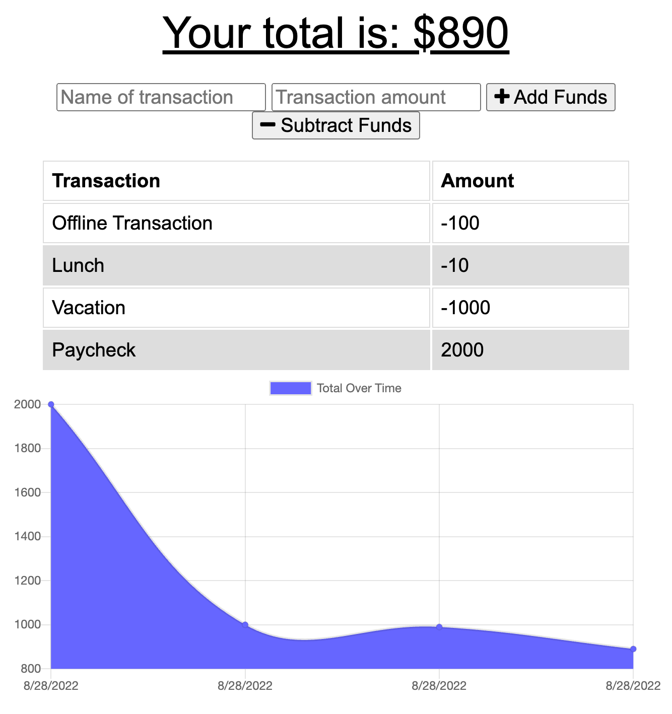

# Challenge 19 Budget Tracker

## Project Purpose

A progressive web application budget tracker with offline functionality.

## App Built With

- JavaScript ES6 / ES2015
- MongoDB
- Node.js
- Express.js
- Mongoose
- Compression (npm package)
- Morgan (npm package)

## Usage

https://serene-plateau-06938.herokuapp.com/

Input the name for your item as well as the dollar amount. Click "+ Add Funds" to input a positive dollar amount, or "- Subtract Funds" to input a negative dollar amount. The transaction log is updated automatically. As an offline-enabled app, the application will save transactions to indexedDB if internet connectivity is lost. Console log messages will confirm the receipt and local saving of new transaction log entries while offline. Offline entries are automatically synced to the live database when internet connectivity is restored.

## Contributors

Made with ❤️ by Joe Gallina with starter code by Trilogy Education Services
